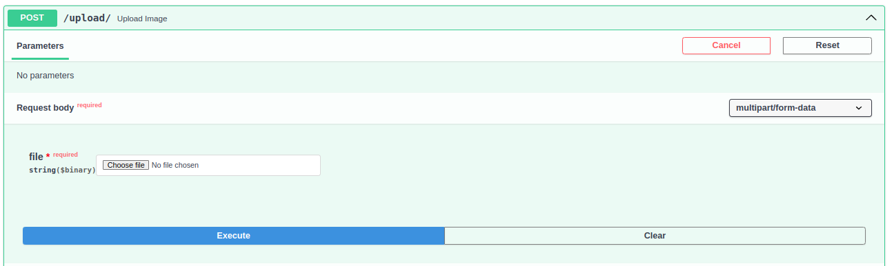

<h1 align="center">Data Science Challenge</h1>

## Case study 

In today's increasingly complicated world with a variety of businesses and procedures within, manually extracting information from invoices can be time-consuming. Additionally, there are various issues that arise throughout the processing of an invoice. Develop a method to retrieve this data automatically that could help businesses digitize and automate the whole process of invoice extraction.

## Outcome

Using this solution, the user will be able to extract the below outcomes as a result when the user uploads an invoice image.
* Company Name
* Amount
* Address
* Date

## Installation

There are only two prerequisites:

* [Docker](https://docs.docker.com/get-docker/)
* [Docker-compose](https://docs.docker.com/compose/install/)

Having both, you'll need to clone the repository:

``` bash
git clone https://github.com/arunvignesh15/DataScienceChallenge
```

## Usage

You'll need to run the docker containers:

``` bash
docker-compose up
```

Now you have access to those three containers and their respective ports:

* FastAPI: http://localhost:8000/
* Prometheus: http://localhost:9090/
* Grafana: http://localhost:3000/

To view the FastAPI Swagger page is available on `http://localhost:8000/docs` endpoint, here you can see all available routes that have been added.


<p align="center">
  
</p>

* Click on the `Upload` route end point and click the `Try it out` button

<p align="center">
  
</p>

* Now you can `upload` the invoice image and do the necessary testing.

<p align="center">
  
</p>

**Note**
For the first upload, you will see a slowness, as in the background the system is downloading the model from `Hugging Face`. From the second upload onwards that will be fixed.


On the FastAPI, you can access `/metrics` endpoint to see the data Prometheus is scraping from it.

## How would you monitor the solution?

Here I have come up with 2 approaches 
1. Using Log monitoring 
2. Using Prometheus and Grafana 

The Log files will be created for each execution within the container image.

Also, you can monitor the solution using Grafana, which provides 
* Total request per minute
* Request per minutes
* Errors per second
* Average response time
* Request Duration
* Memory Usage
* CPU Usage

You can access it via `http://localhost:3000/`

User Name: `admin`

Password: `pass@123`

After that follow below steps:

* Click the sandwich button near to Home at the top left 

<p align="center">
  
</p>

* Click the `Dashboard` option and you can see the `Services` option on the right side. Click the `Services`, and a `FastAPI Dashboard` option will appear. Click on that.

<p align="center">
  
</p>

* As a result you can able to view the Grafana Dashboard which is monitoring our Fast API service will be visible.

<p align="center">
  
</p>

## How would you enhance the given data?

For enhancement, I have used an Image processing technique for the user-uploaded image. At first, I identified the bold characters from the image and removed them from the user-uploaded image, then later on I applied the below techniques. 

* Threshold
* GaussianBlur
* Adaptive Threshold

## Output

As an output, `FinalResultWithImageProcsessing` and `FinalResultWithoutImageProcsessing` keys dictionary will be provided.

The `FinalResultWithImageProcsessing` results mean the output from the enhanced image after the image processing.

The `FinalResultWithoutImageProcsessing` results mean the output from the raw user-uploaded image without the image processing.
 

_{
  "FinalResultWithImageProcsessing": {
    "Company Name": "TRADING",
    "Amount": "37,00",
    "Address": ",H0.284,JALAN HARMONT",
    "Date": "3/2,"
  },
  "FinalResultWithoutImageProcsessing": {
    "Company Name": "tan chay yee ABC HO TRADING",
    "Amount": "31.00",
    "Address": "81100",
    "Date": "09/01/2019"
  }
}_

